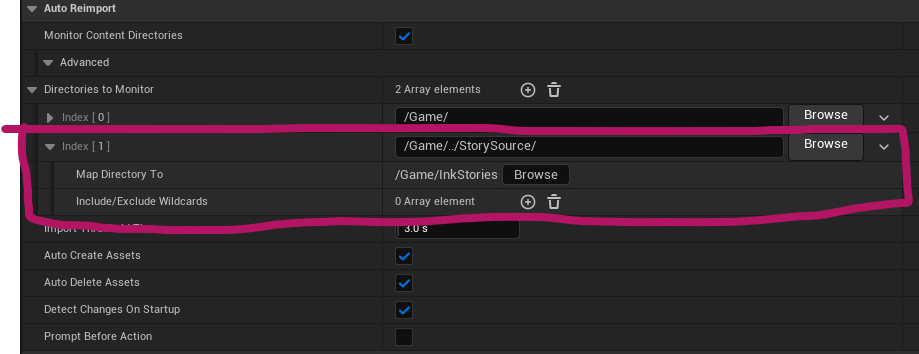

# Project Swordfish - Dev notes

## Dependencies 
- .NET Framework 5.0 is required to be able to correctly import .ink files through Inkpot. https://dotnet.microsoft.com/en-us/download/dotnet/thank-you/runtime-5.0.17-windows-x64-installer

## How to auto-reimport ink stories
 - Go to Editor Preferences->General->Loading and Saving
 - Add a new folder to track with these settings
 
 - all ink stories will re-import automatically when changed, added and deleted!